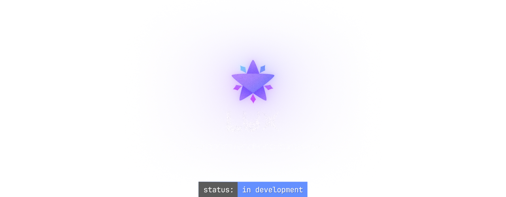

# ✦ Lux

### Platform Support
- [x] Windows (Implementing Win32 Backend)
- [ ] Linux (Planned: X11)
- [ ] macOS (Planned: Cocoa)

### How to Run (Windows)

#### Dependencies
- Python
- CLANG (with a toolchain like MSVC on Windows)

#### Compiling

1. Clone the repository:
```bash
git clone https://github.com/neverevis/Lux
cd Lux
```

2. Change the settings on build_config.json (Compiler, Source Directory, C++ Version, ...)

3. Use the build.py script to compile:
```bash
python build.py
build/bin/sandbox.exe
```
